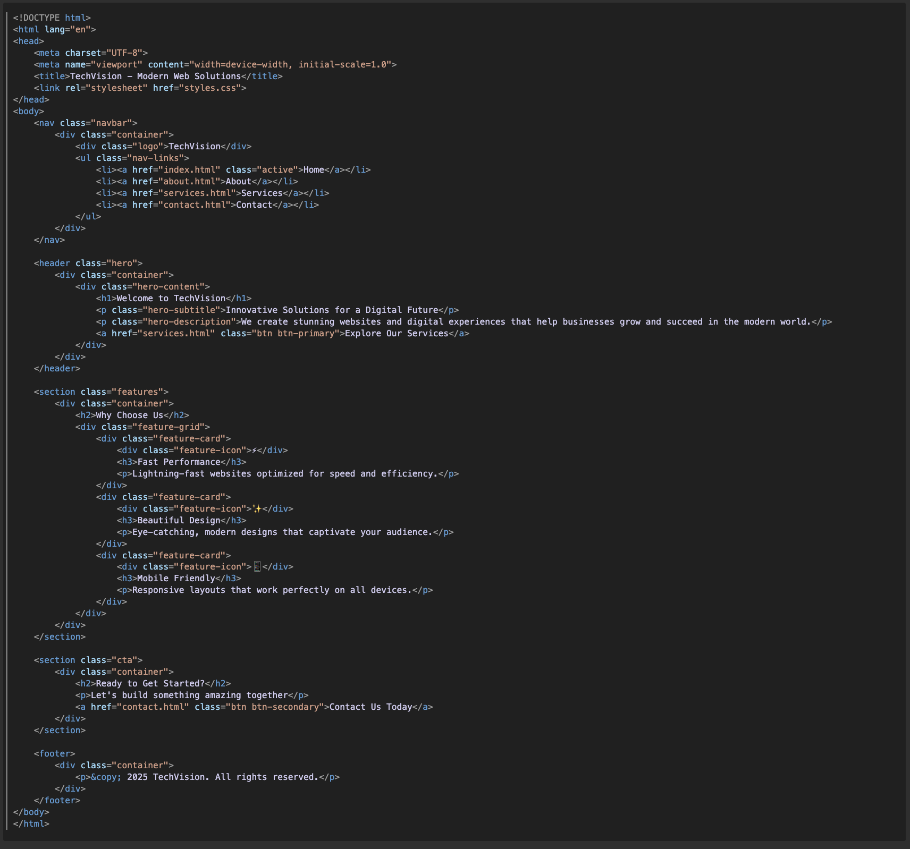
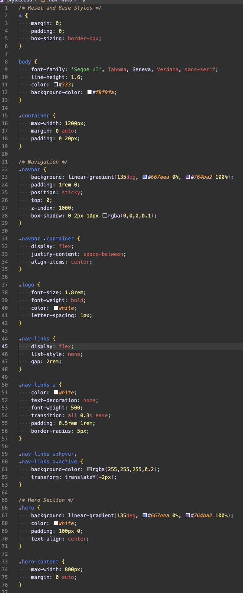
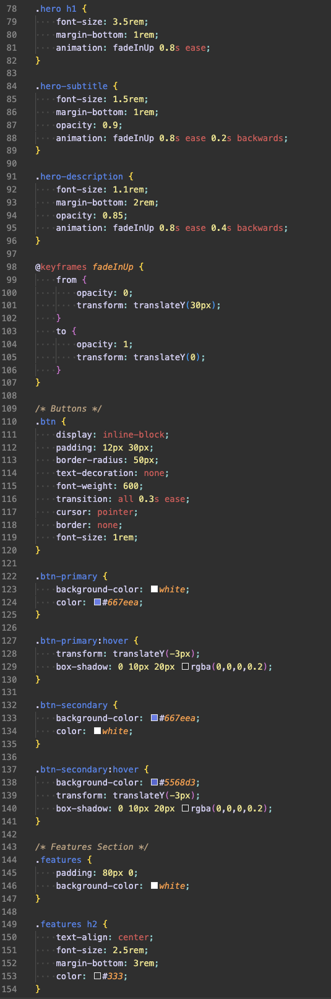
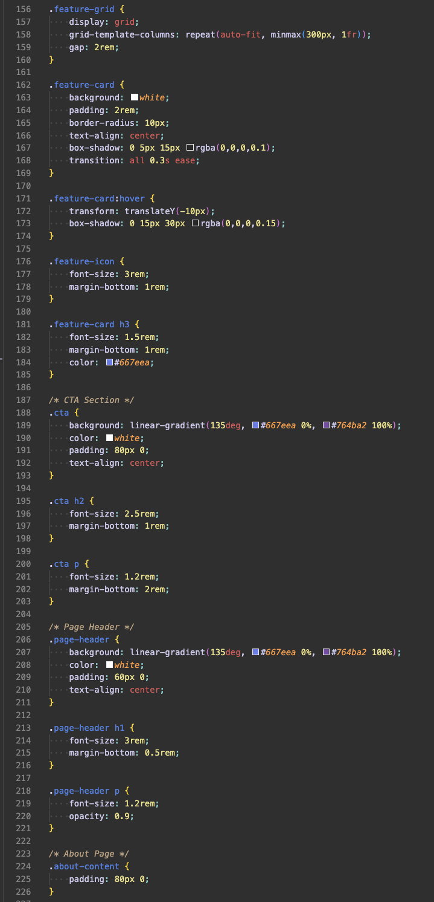
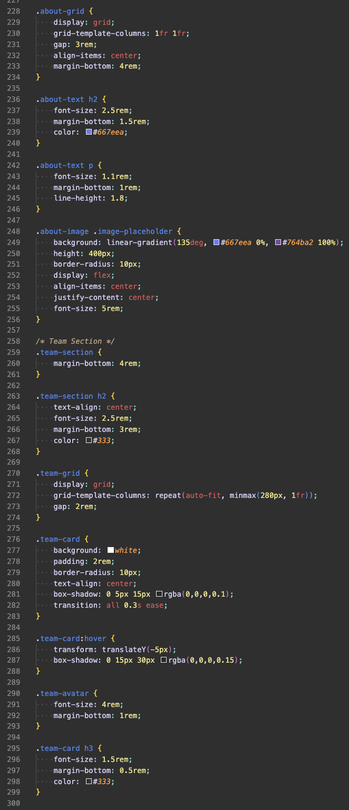
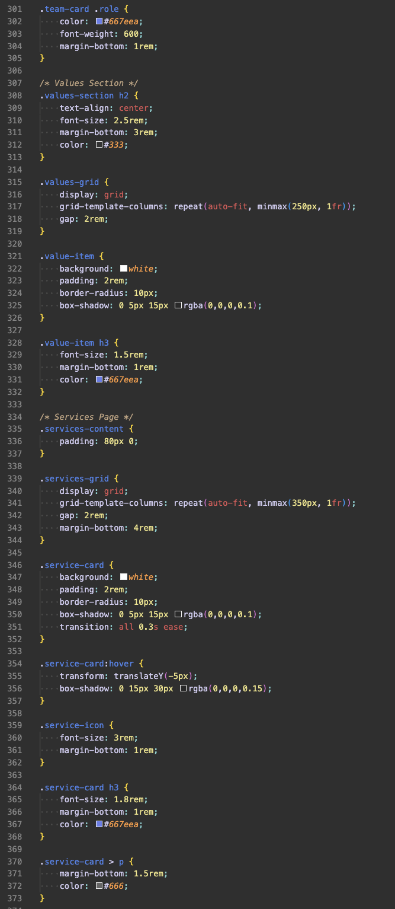
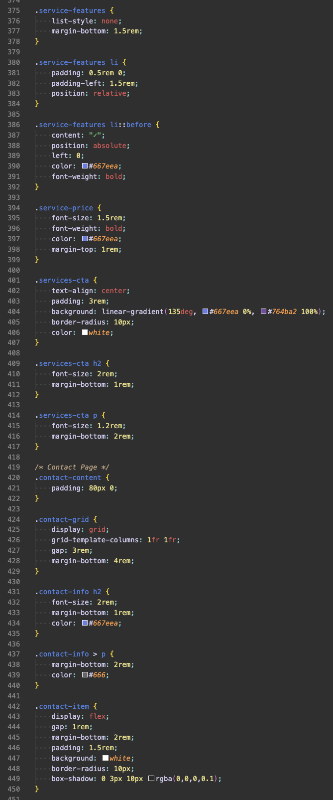
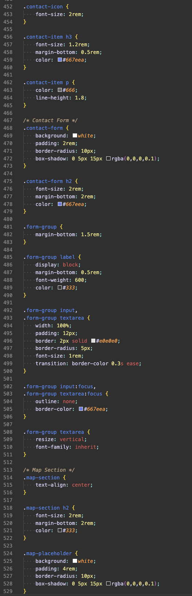
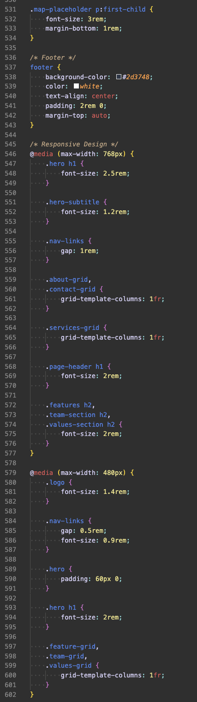
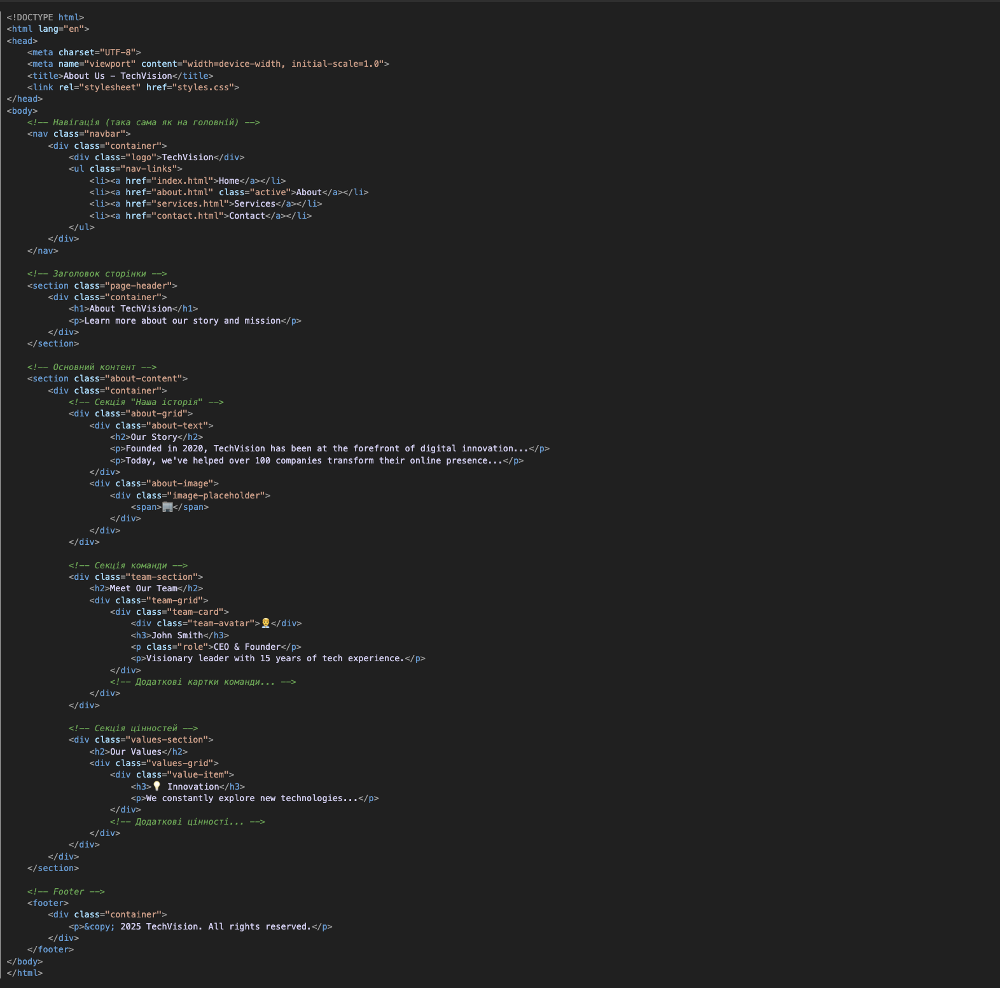

# Покрокова інструкція створення веб-сайту TechVision

## Зміст
1. [Вступ](#вступ)
2. [Структура проекту](#структура-проекту)
3. [Крок 1: Створення головної сторінки (index.html)](#крок-1-створення-головної-сторінки)
4. [Крок 2: Створення файлу стилів (styles.css)](#крок-2-створення-файлу-стилів)
5. [Крок 3: Створення сторінки "Про нас" (about.html)](#крок-3-створення-сторінки-про-нас)
6. [Крок 4: Створення сторінки "Послуги" (services.html)](#крок-4-створення-сторінки-послуги)
7. [Крок 5: Створення сторінки "Контакти" (contact.html)](#крок-5-створення-сторінки-контакти)
8. [Додаткові пояснення](#додаткові-пояснення)

---

## Структура проекту

Створіть папку для вашого проекту та додайте в неї такі файли:

```
my-website/
├── index.html          (головна сторінка)
├── about.html          (сторінка "Про нас")
├── services.html       (сторінка "Послуги")
├── contact.html        (сторінка "Контакти")
└── styles.css          (файл зі стилями)
```

---

## Крок 1: Створення головної сторінки

### 1.1 Базова структура HTML

Створіть файл `index.html` і додайте базову структуру:

```html
<!DOCTYPE html>
<html lang="en">
<head>
    <meta charset="UTF-8">
    <meta name="viewport" content="width=device-width, initial-scale=1.0">
    <title>TechVision - Modern Web Solutions</title>
    <link rel="stylesheet" href="styles.css">
</head>
<body>
    <!-- Тут буде вміст сторінки -->
</body>
</html>
```

**Пояснення кожного елемента:**

- `<!DOCTYPE html>` - повідомляє браузеру, що це HTML5 документ
- `<html lang="en">` - кореневий елемент сторінки, `lang="en"` вказує мову (англійська)
- `<head>` - контейнер для метаданих (інформації про сторінку)
- `<meta charset="UTF-8">` - вказує кодування символів (підтримка української мови та спецсимволів)
- `<meta name="viewport" content="width=device-width, initial-scale=1.0">` - налаштування для адаптивного дизайну на мобільних пристроях
  - `width=device-width` - ширина сторінки відповідає ширині екрану
  - `initial-scale=1.0` - початковий масштаб 100%
- `<title>` - назва сторінки, що відображається у вкладці браузера
- `<link rel="stylesheet" href="styles.css">` - підключення файлу зі стилями
  - `rel="stylesheet"` - вказує, що це таблиця стилів
  - `href="styles.css"` - шлях до файлу стилів
- `<body>` - контейнер для видимого вмісту сторінки

### 1.2 Створення навігаційного меню

Додайте навігацію всередині `<body>`:

```html
<nav class="navbar">
    <div class="container">
        <div class="logo">TechVision</div>
        <ul class="nav-links">
            <li><a href="index.html" class="active">Home</a></li>
            <li><a href="about.html">About</a></li>
            <li><a href="services.html">Services</a></li>
            <li><a href="contact.html">Contact</a></li>
        </ul>
    </div>
</nav>
```

**Пояснення елементів навігації:**

- `<nav>` - семантичний тег для навігаційного меню
- `class="navbar"` - CSS клас для стилізації (можна застосувати стилі до всіх елементів з цим класом)
- `<div class="container">` - контейнер для обмеження ширини контенту
- `<div class="logo">` - логотип сайту
- `<ul>` - невпорядкований список (unordered list)
- `<li>` - елемент списку (list item)
- `<a href="index.html">` - посилання
  - `href` - адреса, куди веде посилання
  - `class="active"` - клас для підсвічування активної сторінки

### 1.3 Створення Hero Section

```html
<header class="hero">
    <div class="container">
        <div class="hero-content">
            <h1>Welcome to TechVision</h1>
            <p class="hero-subtitle">Innovative Solutions for a Digital Future</p>
            <p class="hero-description">We create stunning websites and digital experiences that help businesses grow and succeed in the modern world.</p>
            <a href="services.html" class="btn btn-primary">Explore Our Services</a>
        </div>
    </div>
</header>
```

**Пояснення:**

- `<header>` - семантичний тег для заголовка сторінки або секції
- `<h1>` - заголовок першого рівня (найважливіший заголовок на сторінці, має бути тільки один)
- `<p>` - параграф (абзац тексту)
- `<a>` з класами `btn btn-primary` - посилання, стилізоване як кнопка
  - можна застосувати кілька класів, розділяючи їх пробілом

### 1.4 Секція Features

```html
<section class="features">
    <div class="container">
        <h2>Why Choose Us</h2>
        <div class="feature-grid">
            <div class="feature-card">
                <div class="feature-icon">⚡</div>
                <h3>Fast Performance</h3>
                <p>Lightning-fast websites optimized for speed and efficiency.</p>
            </div>
            <div class="feature-card">
                <div class="feature-icon">✨</div>
                <h3>Beautiful Design</h3>
                <p>Eye-catching, modern designs that captivate your audience.</p>
            </div>
            <div class="feature-card">
                <div class="feature-icon">📱</div>
                <h3>Mobile Friendly</h3>
                <p>Responsive layouts that work perfectly on all devices.</p>
            </div>
        </div>
    </div>
</section>
```

**Пояснення:**

- `<section>` - семантичний тег для тематичної секції контенту
- `<h2>` - заголовок другого рівня (менш важливий ніж h1)
- `<h3>` - заголовок третього рівня
- `<div class="feature-grid">` - контейнер для сітки карток
- `<div class="feature-card">` - окрема картка з перевагою
- Емодзі (⚡✨📱) використовуються як іконки

### 1.5 Секція Call-to-Action (CTA)

```html
<section class="cta">
    <div class="container">
        <h2>Ready to Get Started?</h2>
        <p>Let's build something amazing together</p>
        <a href="contact.html" class="btn btn-secondary">Contact Us Today</a>
    </div>
</section>
```

**Пояснення:**

- CTA (Call-to-Action) - секція, яка спонукає користувача до дії
- `class="btn btn-secondary"` - кнопка з альтернативним стилем

### 1.6 Footer

```html
<footer>
    <div class="container">
        <p>&copy; 2025 TechVision. All rights reserved.</p>
    </div>
</footer>
```

**Пояснення:**

- `<footer>` - семантичний тег для футера
- `&copy;` - HTML-сутність для символу копірайту (©)

### 1.7 Повний код index.html


---

## Крок 2: Створення файлу стилів

Створіть файл `styles.css`. Ми будемо додавати стилі поступово.

### 2.1 Базові стилі

```css
/* Reset and Base Styles */
* {
    margin: 0;
    padding: 0;
    box-sizing: border-box;
}
```

**Пояснення:**

- `*` - універсальний селектор (вибирає всі елементи)
- `margin: 0;` - прибирає зовнішні відступи
- `padding: 0;` - прибирає внутрішні відступи
- `box-sizing: border-box;` - змінює модель розрахунку розміру елементів (ширина включає padding і border)
- `/* коментар */` - коментарі в CSS (браузер їх ігнорує)

### 2.2 Стилі для body

```css
body {
    font-family: 'Segoe UI', Tahoma, Geneva, Verdana, sans-serif;
    line-height: 1.6;
    color: #333;
    background-color: #f8f9fa;
}
```

**Пояснення властивостей:**

- `font-family` - набір шрифтів (браузер використає перший доступний)
- `line-height: 1.6;` - висота рядка (1.6 = 160% від розміру шрифту)
- `color: #333;` - колір тексту (темно-сірий, hex-код)
- `background-color: #f8f9fa;` - колір фону (світло-сірий)

### 2.3 Контейнер

```css
.container {
    max-width: 1200px;
    margin: 0 auto;
    padding: 0 20px;
}
```

**Пояснення:**

- `.container` - селектор класу (вибирає елементи з класом "container")
- `max-width: 1200px;` - максимальна ширина 1200 пікселів
- `margin: 0 auto;` - центрування по горизонталі
  - `0` - верхній та нижній відступи
  - `auto` - автоматичні лівий та правий відступи (центрування)
- `padding: 0 20px;` - внутрішні відступи
  - `0` - зверху та знизу
  - `20px` - зліва та справа

### 2.4 Стилі навігації

```css
.navbar {
    background: linear-gradient(135deg, #667eea 0%, #764ba2 100%);
    padding: 1rem 0;
    position: sticky;
    top: 0;
    z-index: 1000;
    box-shadow: 0 2px 10px rgba(0,0,0,0.1);
}
```

**Пояснення властивостей:**

- `background: linear-gradient()` - градієнтний фон
  - `135deg` - кут нахилу (135 градусів)
  - `#667eea 0%` - початковий колір (фіолетовий) на 0%
  - `#764ba2 100%` - кінцевий колір (темно-фіолетовий) на 100%
- `padding: 1rem 0;` - внутрішні відступи
  - `1rem` - зверху та знизу (rem - відносна одиниця, 1rem ≈ 16px)
  - `0` - зліва та справа
- `position: sticky;` - елемент "приклеюється" до верху при прокручуванні
- `top: 0;` - відстань від верху
- `z-index: 1000;` - порядок накладання (більше число = вище)
- `box-shadow` - тінь
  - `0` - зміщення по горизонталі
  - `2px` - зміщення по вертикалі
  - `10px` - розмиття
  - `rgba(0,0,0,0.1)` - колір тіні (чорний з прозорістю 10%)

```css
.navbar .container {
    display: flex;
    justify-content: space-between;
    align-items: center;
}
```

**Пояснення Flexbox:**

- `display: flex;` - вмикає flexbox (гнучку розмітку)
- `justify-content: space-between;` - розподіляє елементи з максимальним простором між ними
- `align-items: center;` - вирівнює елементи по центру по вертикалі

```css
.logo {
    font-size: 1.8rem;
    font-weight: bold;
    color: white;
    letter-spacing: 1px;
}
```

**Пояснення:**

- `font-size: 1.8rem;` - розмір шрифту
- `font-weight: bold;` - жирний шрифт
- `color: white;` - білий колір
- `letter-spacing: 1px;` - відстань між літерами

```css
.nav-links {
    display: flex;
    list-style: none;
    gap: 2rem;
}
```

**Пояснення:**

- `list-style: none;` - прибирає маркери списку
- `gap: 2rem;` - відстань між елементами flexbox

```css
.nav-links a {
    color: white;
    text-decoration: none;
    font-weight: 500;
    transition: all 0.3s ease;
    padding: 0.5rem 1rem;
    border-radius: 5px;
}
```

**Пояснення:**

- `.nav-links a` - вибирає всі посилання (`<a>`) всередині `.nav-links`
- `text-decoration: none;` - прибирає підкреслення посилань
- `transition: all 0.3s ease;` - плавний перехід для всіх змін протягом 0.3 секунди
- `border-radius: 5px;` - заокруглення кутів

```css
.nav-links a:hover,
.nav-links a.active {
    background-color: rgba(255,255,255,0.2);
    transform: translateY(-2px);
}
```

**Пояснення:**

- `:hover` - псевдоклас, спрацьовує при наведенні миші
- `.nav-links a.active` - посилання з класом "active"
- `rgba(255,255,255,0.2)` - білий колір з прозорістю 20%
- `transform: translateY(-2px);` - зміщення на 2 пікселі вгору

### 2.5 Стилі Hero секції

```css
.hero {
    background: linear-gradient(135deg, #667eea 0%, #764ba2 100%);
    color: white;
    padding: 100px 0;
    text-align: center;
}
```

**Пояснення:**

- `padding: 100px 0;` - великі відступи зверху та знизу
- `text-align: center;` - центрування тексту

```css
.hero-content {
    max-width: 800px;
    margin: 0 auto;
}
```

```css
.hero h1 {
    font-size: 3.5rem;
    margin-bottom: 1rem;
    animation: fadeInUp 0.8s ease;
}
```

**Пояснення:**

- `.hero h1` - вибирає `<h1>` всередині `.hero`
- `animation: fadeInUp 0.8s ease;` - застосовує анімацію
  - `fadeInUp` - назва анімації
  - `0.8s` - тривалість
  - `ease` - функція пом'якшення (плавний початок і кінець)

```css
@keyframes fadeInUp {
    from {
        opacity: 0;
        transform: translateY(30px);
    }
    to {
        opacity: 1;
        transform: translateY(0);
    }
}
```

**Пояснення анімації:**

- `@keyframes` - визначення анімації
- `from` - початковий стан (прозорість 0, зміщення вниз на 30px)
- `to` - кінцевий стан (повна непрозорість, початкова позиція)
- `opacity` - прозорість (0 = повністю прозорий, 1 = непрозорий)

### 2.6 Стилі кнопок

```css
.btn {
    display: inline-block;
    padding: 12px 30px;
    border-radius: 50px;
    text-decoration: none;
    font-weight: 600;
    transition: all 0.3s ease;
    cursor: pointer;
    border: none;
    font-size: 1rem;
}
```

**Пояснення:**

- `display: inline-block;` - поведінка як рядковий елемент, але з можливістю задати ширину та висоту
- `border-radius: 50px;` - сильне заокруглення (кнопка-пілюля)
- `cursor: pointer;` - курсор-рука при наведенні
- `border: none;` - без рамки

```css
.btn-primary {
    background-color: white;
    color: #667eea;
}

.btn-primary:hover {
    transform: translateY(-3px);
    box-shadow: 0 10px 20px rgba(0,0,0,0.2);
}
```

**Пояснення:**

- При наведенні кнопка піднімається на 3px і з'являється тінь

### 2.7 Стилі карток переваг

```css
.features {
    padding: 80px 0;
    background-color: white;
}

.features h2 {
    text-align: center;
    font-size: 2.5rem;
    margin-bottom: 3rem;
    color: #333;
}
```

```css
.feature-grid {
    display: grid;
    grid-template-columns: repeat(auto-fit, minmax(300px, 1fr));
    gap: 2rem;
}
```

**Пояснення CSS Grid:**

- `display: grid;` - вмикає CSS Grid (систему сіток)
- `grid-template-columns` - визначає колонки
  - `repeat()` - повторення шаблону
  - `auto-fit` - автоматичне підлаштування кількості колонок
  - `minmax(300px, 1fr)` - мінімум 300px, максимум 1 частина (fr = fraction)
- `gap: 2rem;` - відстань між комірками сітки

```css
.feature-card {
    background: white;
    padding: 2rem;
    border-radius: 10px;
    text-align: center;
    box-shadow: 0 5px 15px rgba(0,0,0,0.1);
    transition: all 0.3s ease;
}

.feature-card:hover {
    transform: translateY(-10px);
    box-shadow: 0 15px 30px rgba(0,0,0,0.15);
}
```

**Пояснення:**

- При наведенні картка піднімається на 10px і тінь стає більшою

### 2.8 Адаптивний дизайн (Media Queries)

```css
@media (max-width: 768px) {
    .hero h1 {
        font-size: 2.5rem;
    }

    .nav-links {
        gap: 1rem;
    }
}
```

**Пояснення:**

- `@media (max-width: 768px)` - медіа-запит для екранів шириною до 768px
- Стилі всередині застосовуються тільки на маленьких екранах (планшети, телефони)

### 2.9 Повний файл styles.css










---

## Крок 3: Створення сторінки "Про нас"

### 3.1 Базова структура about.html



### 3.2 CSS для сторінки "Про нас"

```css
/* Page Header - заголовок сторінки */
.page-header {
    background: linear-gradient(135deg, #667eea 0%, #764ba2 100%);
    color: white;
    padding: 60px 0;
    text-align: center;
}
```

```css
/* About Grid - двоколонкова розмітка */
.about-grid {
    display: grid;
    grid-template-columns: 1fr 1fr;
    gap: 3rem;
    align-items: center;
    margin-bottom: 4rem;
}
```

**Пояснення:**

- `grid-template-columns: 1fr 1fr;` - дві рівні колонки
- `align-items: center;` - вирівнювання по центру по вертикалі

```css
/* Team Grid - сітка карток команди */
.team-grid {
    display: grid;
    grid-template-columns: repeat(auto-fit, minmax(280px, 1fr));
    gap: 2rem;
}
```

```css
/* Team Card - картка члена команди */
.team-card {
    background: white;
    padding: 2rem;
    border-radius: 10px;
    text-align: center;
    box-shadow: 0 5px 15px rgba(0,0,0,0.1);
    transition: all 0.3s ease;
}

.team-card:hover {
    transform: translateY(-5px);
    box-shadow: 0 15px 30px rgba(0,0,0,0.15);
}
```

---

## Крок 4: Створення сторінки "Послуги"

### 4.1 Структура services.html

Ця сторінка містить картки послуг з детальною інформацією.

```html
<section class="services-content">
    <div class="container">
        <div class="services-grid">
            <div class="service-card">
                <div class="service-icon">💻</div>
                <h3>Web Development</h3>
                <p>Custom websites built with the latest technologies...</p>

                <!-- Список можливостей -->
                <ul class="service-features">
                    <li>Responsive Design</li>
                    <li>Modern Frameworks</li>
                    <li>SEO Optimization</li>
                    <li>Fast Loading Speed</li>
                </ul>

                <div class="service-price">Starting at $2,500</div>
            </div>
            <!-- Інші картки послуг... -->
        </div>
    </div>
</section>
```

### 4.2 CSS для карток послуг

```css
.services-grid {
    display: grid;
    grid-template-columns: repeat(auto-fit, minmax(350px, 1fr));
    gap: 2rem;
    margin-bottom: 4rem;
}
```

```css
/* Service Features - список можливостей */
.service-features {
    list-style: none;
    margin-bottom: 1.5rem;
}

.service-features li {
    padding: 0.5rem 0;
    padding-left: 1.5rem;
    position: relative;
}

.service-features li::before {
    content: "✓";
    position: absolute;
    left: 0;
    color: #667eea;
    font-weight: bold;
}
```

**Пояснення псевдоелемента:**

- `::before` - створює псевдоелемент перед вмістом
- `content: "✓";` - вміст псевдоелемента (галочка)
- `position: absolute;` - абсолютне позиціонування
- `left: 0;` - позиція зліва

```css
.service-price {
    font-size: 1.5rem;
    font-weight: bold;
    color: #667eea;
    margin-top: 1rem;
}
```

---

## Крок 5: Створення сторінки "Контакти"

### 5.1 Структура contact.html

```html
<section class="contact-content">
    <div class="container">
        <div class="contact-grid">
            <!-- Ліва колонка - контактна інформація -->
            <div class="contact-info">
                <h2>Contact Information</h2>
                <p>Have a question or want to work together?</p>

                <div class="contact-item">
                    <div class="contact-icon">📍</div>
                    <div>
                        <h3>Address</h3>
                        <p>123 Tech Street<br>San Francisco, CA 94105</p>
                    </div>
                </div>
                <!-- Інші контактні елементи... -->
            </div>

            <!-- Права колонка - форма -->
            <div class="contact-form">
                <h2>Send Us a Message</h2>
                <form>
                    <div class="form-group">
                        <label for="name">Full Name</label>
                        <input type="text" id="name" name="name" placeholder="John Doe" required>
                    </div>

                    <div class="form-group">
                        <label for="email">Email Address</label>
                        <input type="email" id="email" name="email" placeholder="john@example.com" required>
                    </div>

                    <div class="form-group">
                        <label for="message">Message</label>
                        <textarea id="message" name="message" rows="5" placeholder="Tell us more..." required></textarea>
                    </div>

                    <button type="submit" class="btn btn-primary">Send Message</button>
                </form>
            </div>
        </div>
    </div>
</section>
```

### 5.2 Елементи форми - детальне пояснення

**Label (підпис поля):**

```html
<label for="name">Full Name</label>
```

- `<label>` - підпис для поля вводу
- `for="name"` - зв'язує label з input через id (клік на label активує поле)

**Input (поле вводу):**

```html
<input type="text" id="name" name="name" placeholder="John Doe" required>
```

**Пояснення атрибутів:**

- `type="text"` - тип поля (текст)
  - `type="email"` - поле для email (автоматична валідація)
  - `type="tel"` - поле для телефону
- `id="name"` - унікальний ідентифікатор
- `name="name"` - ім'я поля (використовується при відправці форми)
- `placeholder="..."` - підказка, що відображається в порожньому полі
- `required` - обов'язкове поле (булевий атрибут)

**Textarea (багаторядкове поле):**

```html
<textarea id="message" name="message" rows="5" required></textarea>
```

- `rows="5"` - кількість видимих рядків

**Button (кнопка):**

```html
<button type="submit" class="btn btn-primary">Send Message</button>
```

- `type="submit"` - кнопка відправки форми

### 5.3 CSS для форми

```css
.contact-grid {
    display: grid;
    grid-template-columns: 1fr 1fr;
    gap: 3rem;
    margin-bottom: 4rem;
}
```

```css
.form-group {
    margin-bottom: 1.5rem;
}

.form-group label {
    display: block;
    margin-bottom: 0.5rem;
    font-weight: 600;
    color: #333;
}
```

**Пояснення:**

- `display: block;` - label займає весь рядок

```css
.form-group input,
.form-group textarea {
    width: 100%;
    padding: 12px;
    border: 2px solid #e0e0e0;
    border-radius: 5px;
    font-size: 1rem;
    transition: border-color 0.3s ease;
}
```

**Пояснення:**

- `width: 100%;` - поле на всю ширину контейнера
- Комбінований селектор `input, textarea` застосовує стилі до обох типів

```css
.form-group input:focus,
.form-group textarea:focus {
    outline: none;
    border-color: #667eea;
}
```

**Пояснення:**

- `:focus` - псевдоклас, активується коли поле в фокусі (користувач клікнув на нього)
- `outline: none;` - прибирає стандартний outline браузера
- Рамка стає фіолетовою при фокусі

```css
.form-group textarea {
    resize: vertical;
    font-family: inherit;
}
```

**Пояснення:**

- `resize: vertical;` - дозволяє змінювати розмір тільки по вертикалі
- `font-family: inherit;` - успадковує шрифт від батьківського елемента

---

## Додаткові пояснення

### Семантичні теги HTML5

HTML5 додав спеціальні теги для кращої структури:

- `<header>` - заголовок сторінки або секції
- `<nav>` - навігаційне меню
- `<section>` - тематична секція контенту
- `<article>` - незалежний контент (стаття, новина)
- `<aside>` - додатковий контент (сайдбар)
- `<footer>` - підвал сторінки або секції

**Чому використовувати?**
- Краща структура коду
- Зрозуміліше для пошукових систем (SEO)
- Доступність для людей з обмеженими можливостями

### CSS Селектори - Повний список

```css
/* Селектор елемента */
p { color: blue; }

/* Селектор класу */
.my-class { color: red; }

/* Селектор ID */
#my-id { color: green; }

/* Комбінований селектор (всі p всередині .container) */
.container p { color: purple; }

/* Дочірній селектор (тільки прямі діти) */
.parent > .child { color: orange; }

/* Селектор атрибута */
input[type="text"] { border: 1px solid blue; }

/* Псевдокласи */
a:hover { color: red; }        /* при наведенні */
input:focus { border: 2px; }   /* при фокусі */
li:first-child { font-weight: bold; }  /* перший елемент */
li:last-child { margin-bottom: 0; }    /* останній елемент */
div:nth-child(2) { color: blue; }      /* другий елемент */

/* Псевдоелементи */
p::before { content: "→ "; }   /* перед вмістом */
p::after { content: " ←"; }    /* після вмісту */
```

### CSS Одиниці виміру

```css
/* Абсолютні */
px  /* пікселі (1px = 1 піксель на екрані) */
pt  /* пункти (друкарська одиниця) */

/* Відносні */
%   /* відсотки (відносно батьківського елемента) */
em  /* відносно розміру шрифту батька (1em = 16px за замовчуванням) */
rem /* відносно розміру шрифту кореневого елемента */
vw  /* відсотки ширини viewport (1vw = 1% ширини вікна) */
vh  /* відсотки висоти viewport */
```

**Рекомендації:**
- Використовуйте `rem` для шрифтів (легко масштабувати)
- Використовуйте `px` для рамок та малих відступів
- Використовуйте `%` або `vw/vh` для адаптивних розмірів

### Flexbox - Детальний огляд

Flexbox - система одновимірної розмітки (рядок або колонка).

**Батьківський контейнер:**

```css
.container {
    display: flex;                    /* вмикає flexbox */
    flex-direction: row;              /* напрямок: row | column */
    justify-content: center;          /* вирівнювання по головній осі */
    align-items: center;              /* вирівнювання по перехресній осі */
    gap: 1rem;                        /* відстань між елементами */
}
```

**Значення justify-content:**
- `flex-start` - на початку
- `flex-end` - в кінці
- `center` - по центру
- `space-between` - максимальна відстань між елементами
- `space-around` - рівна відстань навколо елементів
- `space-evenly` - рівна відстань між усіма елементами

**Дочірні елементи:**

```css
.item {
    flex: 1;           /* займає всю доступну площу */
    flex-grow: 1;      /* коефіцієнт росту */
    flex-shrink: 1;    /* коефіцієнт зменшення */
    flex-basis: 200px; /* базовий розмір */
}
```

### CSS Grid - Детальний огляд

Grid - система двовимірної розмітки (рядки та колонки).

```css
.container {
    display: grid;

    /* Визначення колонок */
    grid-template-columns: 200px 1fr 200px;  /* 3 колонки: фіксована, гнучка, фіксована */
    grid-template-columns: repeat(3, 1fr);   /* 3 рівні колонки */
    grid-template-columns: repeat(auto-fit, minmax(300px, 1fr));  /* адаптивна сітка */

    /* Визначення рядків */
    grid-template-rows: 100px auto 100px;

    /* Відстані */
    gap: 20px;           /* відстань між комірками */
    row-gap: 20px;       /* відстань між рядками */
    column-gap: 20px;    /* відстань між колонками */
}
```

**Розміщення елементів:**

```css
.item {
    grid-column: 1 / 3;      /* займає колонки з 1 по 3 */
    grid-row: 1 / 2;         /* займає рядок 1 */
    grid-area: 1 / 1 / 3 / 3;  /* row-start / col-start / row-end / col-end */
}
```

### Кольори в CSS

```css
/* Назви кольорів */
color: red;
color: blue;

/* HEX (шістнадцятковий) */
color: #ff0000;  /* червоний */
color: #00ff00;  /* зелений */
color: #0000ff;  /* синій */
color: #fff;     /* біло (скорочений запис) */

/* RGB (Red, Green, Blue) */
color: rgb(255, 0, 0);  /* червоний */

/* RGBA (з прозорістю) */
color: rgba(255, 0, 0, 0.5);  /* напівпрозорий червоний */

/* HSL (Hue, Saturation, Lightness) */
color: hsl(0, 100%, 50%);  /* червоний */
```

### Box Model (Блочна модель)

Кожен елемент складається з:

```
┌─────────────────────────────────┐
│ Margin (зовнішній відступ)      │
│ ┌─────────────────────────────┐ │
│ │ Border (рамка)              │ │
│ │ ┌─────────────────────────┐ │ │
│ │ │ Padding (внутрішній     │ │ │
│ │ │         відступ)        │ │ │
│ │ │ ┌─────────────────────┐ │ │ │
│ │ │ │ Content (контент)   │ │ │ │
│ │ │ │                     │ │ │ │
│ │ │ └─────────────────────┘ │ │ │
│ │ └─────────────────────────┘ │ │
│ └─────────────────────────────┘ │
└─────────────────────────────────┘
```

```css
.box {
    width: 300px;              /* ширина контенту */
    height: 200px;             /* висота контенту */
    padding: 20px;             /* внутрішній відступ */
    border: 2px solid black;   /* рамка */
    margin: 10px;              /* зовнішній відступ */
}
```

**Короткий запис відступів:**

```css
padding: 10px;                  /* всі сторони */
padding: 10px 20px;             /* верх/низ  право/ліво */
padding: 10px 20px 30px;        /* верх  право/ліво  низ */
padding: 10px 20px 30px 40px;   /* верх  право  низ  ліво (за годинниковою) */
```

### Позиціонування (Position)

```css
/* Static (за замовчуванням) */
position: static;

/* Relative (відносне) */
position: relative;
top: 10px;     /* зміщення вниз на 10px */
left: 20px;    /* зміщення вправо на 20px */

/* Absolute (абсолютне) */
position: absolute;
top: 0;        /* відносно найближчого positioned батька */
right: 0;

/* Fixed (фіксоване) */
position: fixed;
top: 0;        /* фіксується відносно вікна браузера */
left: 0;

/* Sticky (липке) */
position: sticky;
top: 0;        /* стає fixed після прокручування до цієї позиції */
```

### Переходи та анімації

**Переходи (Transitions):**

```css
.button {
    background: blue;
    transition: background 0.3s ease;  /* властивість тривалість функція */
}

.button:hover {
    background: red;  /* плавна зміна кольору */
}
```

**Анімації (Animations):**

```css
/* Визначення анімації */
@keyframes slide {
    0% {
        transform: translateX(0);
    }
    50% {
        transform: translateX(100px);
    }
    100% {
        transform: translateX(0);
    }
}

/* Застосування */
.element {
    animation: slide 2s ease-in-out infinite;
    /* назва тривалість функція повторення */
}
```

### Transform (Трансформації)

```css
/* Переміщення */
transform: translate(50px, 100px);   /* x, y */
transform: translateX(50px);
transform: translateY(100px);

/* Масштабування */
transform: scale(1.5);        /* 150% розміру */
transform: scale(2, 0.5);     /* ширина x2, висота x0.5 */

/* Обертання */
transform: rotate(45deg);     /* на 45 градусів */

/* Нахил */
transform: skew(10deg, 20deg);

/* Комбінація */
transform: translate(50px, 100px) rotate(45deg) scale(1.2);
```

### Адаптивний дизайн (Responsive Design)

**Медіа-запити:**

```css
/* Стилі для всіх екранів за замовчуванням */
.container {
    padding: 20px;
}

/* Планшети (до 768px) */
@media (max-width: 768px) {
    .container {
        padding: 15px;
    }
}

/* Мобільні (до 480px) */
@media (max-width: 480px) {
    .container {
        padding: 10px;
    }
}

/* Великі екрани (від 1200px) */
@media (min-width: 1200px) {
    .container {
        max-width: 1400px;
    }
}
```

**Підхід Mobile-First:**

```css
/* Спочатку стилі для мобільних */
.grid {
    grid-template-columns: 1fr;
}

/* Потім для більших екранів */
@media (min-width: 768px) {
    .grid {
        grid-template-columns: 1fr 1fr;
    }
}

@media (min-width: 1024px) {
    .grid {
        grid-template-columns: repeat(3, 1fr);
    }
}
```

---

## Практичні завдання для учнів

### Завдання 1: Змініть кольорову схему

Змініть фіолетову кольорову схему на власну:

1. Оберіть два кольори для градієнта
2. Знайдіть усі місця в CSS з `#667eea` та `#764ba2`
3. Замініть на свої кольори
4. Збережіть та перевірте результат

### Завдання 2: Додайте нову картку переваги

На головній сторінці додайте четверту картку з перевагою:

1. Скопіюйте код одної з існуючих карток
2. Змініть емодзі-іконку
3. Змініть заголовок та текст
4. Збережіть та перевірте

### Завдання 3: Створіть нову сторінку

Створіть файл `blog.html`:

1. Скопіюйте структуру з `about.html`
2. Змініть заголовок на "Blog"
3. Додайте посилання в навігацію
4. Створіть 3 картки з постами блогу

### Завдання 4: Експерименти з Grid

Змініть сітку карток переваг:

1. Спробуйте різні значення `minmax()`
2. Змініть `gap` між картками
3. Додайте більше карток і подивіться, як вони розташовуються

### Завдання 5: Анімації

Додайте нову анімацію:

1. Створіть `@keyframes` анімацію fade-in справа
2. Застосуйте її до карток переваг
3. Налаштуйте затримку для кожної картки

---

## Корисні ресурси

### Документація
- [MDN Web Docs](https://developer.mozilla.org/) - найкраща документація по HTML/CSS
- [W3Schools](https://www.w3schools.com/) - туторіали та приклади
- [CSS-Tricks](https://css-tricks.com/) - поради та трюки CSS

### Інструменти
- [CodePen](https://codepen.io/) - онлайн редактор для експериментів
- [Can I Use](https://caniuse.com/) - перевірка підтримки CSS властивостей браузерами
- [Google Fonts](https://fonts.google.com/) - безкоштовні шрифти

### Генератори
- [CSS Gradient](https://cssgradient.io/) - генератор градієнтів
- [Box Shadow Generator](https://cssgenerator.org/box-shadow-css-generator.html) - генератор тіней
- [Flexbox Generator](https://flexbox.tech/) - візуальний генератор flexbox

---

## Поради щодо налагодження

### Як знайти помилки:

1. **Перевірте консоль браузера:**
   - F12 або правий клік → "Inspect"
   - Вкладка "Console" покаже помилки

2. **Перевірте Developer Tools:**
   - Вкладка "Elements" - HTML структура
   - Вкладка "Styles" - застосовані CSS правила

3. **Поширені помилки:**
   - Забули закрити тег (наприклад, `</div>`)
   - Забули крапку або решітку в CSS (`.class` або `#id`)
   - Неправильний шлях до файлу (`href="styles.css"`)
   - Опечатки в назвах властивостей

4. **Валідація коду:**
   - [HTML Validator](https://validator.w3.org/)
   - [CSS Validator](https://jigsaw.w3.org/css-validator/)

---
